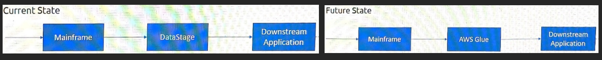
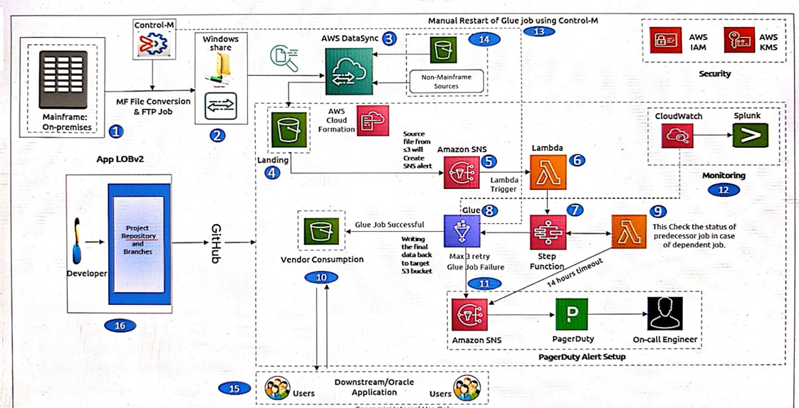
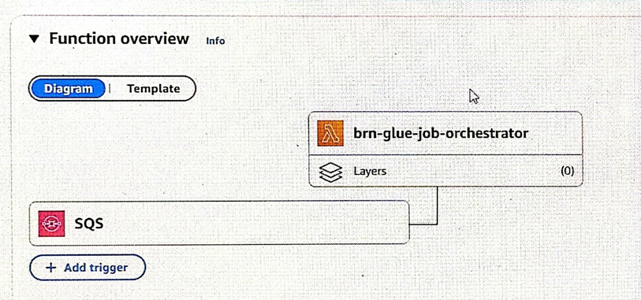
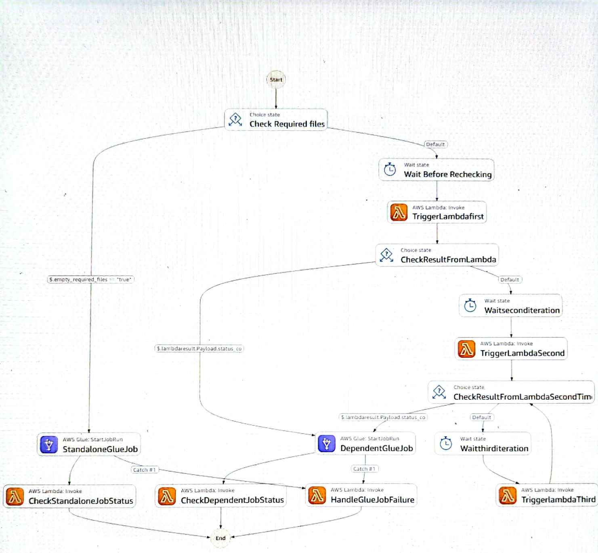
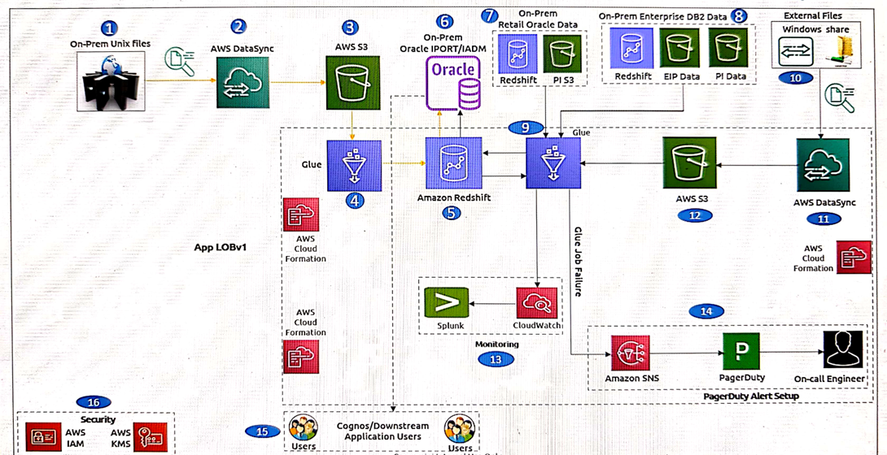

# Project Details — AWS DataStage Modernization, Financial Services Client

**Client:** Financial Services Institution
**Line of Business:** Institutional Investor Group (IIG)
**Role:** Senior Data Engineer
**Engagement:** IBM DataStage to AWS Cloud modernization
**Delivery Model:** Agile (3-sprint Builds, 2-week sprints)

---

## Table of Contents

1. [Business Context](#1-business-context)
2. [Current State vs Future State](#2-current-state-vs-future-state)
3. [Application Landscape](#3-application-landscape)
4. [Non-IPORT Pipeline](#4-non-iport-pipeline)
   - 4.1 [Architecture](#41-architecture)
   - 4.2 [Data Flow — Step by Step](#42-data-flow--step-by-step)
   - 4.3 [Lambda Orchestrator](#43-lambda-orchestrator)
   - 4.4 [Step Functions State Machine](#44-step-functions-state-machine)
   - 4.5 [Medallion Architecture](#45-medallion-architecture)
   - 4.6 [Glue Job Design](#46-glue-job-design)
   - 4.7 [Job Scheduling](#47-job-scheduling)
   - 4.8 [Data Volumes](#48-data-volumes)
5. [IPORT Pipeline](#5-iport-pipeline)
   - 5.1 [Architecture](#51-architecture)
   - 5.2 [Data Ingestion](#52-data-ingestion)
   - 5.3 [ETL and Data Storage](#53-etl-and-data-storage)
   - 5.4 [Migration to Oracle 20](#54-migration-to-oracle-20)
   - 5.5 [Data Validation](#55-data-validation)
   - 5.6 [M_13 Monthly Cycle](#56-m_13-monthly-cycle)
6. [AWS Glue Configuration](#6-aws-glue-configuration)
7. [Amazon Redshift Setup](#7-amazon-redshift-setup)
8. [Challenges and Solutions](#8-challenges-and-solutions)
9. [Delivery and Project Management](#9-delivery-and-project-management)
10. [Security and Infrastructure](#10-security-and-infrastructure)

---

## 1. Business Context

The client's Institutional Investor Group processes high-volume institutional plan sponsor reporting data through a legacy IBM DataStage platform running on-premises. The modernization objective is to migrate the entire ETL layer to AWS Cloud for improved scalability, cost efficiency, operational visibility, and alignment with the firm's cloud-first strategy.

The migration is a **like-for-like replacement**: every transformation replicates the original DataStage logic exactly, producing byte-identical output files. The client requires 100% data match for Non-IPORT and 95% for IPORT before any production cutover.

During the migration period, the new AWS pipeline runs in **Prod Parallel** mode alongside the live DataStage system on the same production data. After sign-off, a cutover switches downstream applications to the new pipeline.

---

## 2. Current State vs Future State



**Current State:**
1. Mainframe generates fixed-width flat files periodically.
2. Files are transferred to a Windows File Share (WFS) via Control-M SFTP jobs.
3. DataStage consumes files from WFS, applies transformations, and loads output to downstream applications.

**Future State:**
1. Mainframe continues generating the same flat files.
2. AWS DataSync syncs files from WFS to Amazon S3 every 5 minutes.
3. AWS Glue jobs extract from S3, replicate the DataStage transformation logic in PySpark, and write output files back to S3 for downstream applications.

---

## 3. Application Landscape

DataStage supports two major batch applications used for institutional plan sponsor reporting:

| | Non-IPORT | IPORT |
|---|---|---|
| Purpose | Financial data and money movement | Business reporting tool |
| Tier | Tier 1 application | — |
| Sign-off requirement | 100% data match | 95% data match |
| Sub-projects | BRD/BRN, CST/CTQ, OMG/PGX | Yearly (Y), Quarterly (Q), Monthly (M), Daily (D) |
| Builds | 3 | 7 |

**Non-IPORT sub-projects:**
- **BRD/BRN** — Bank Reconciliation
- **CST/CTQ** — Compliance Testing Service
- **OMG/PGX** — Pageflex ETL

---

## 4. Non-IPORT Pipeline

### 4.1 Architecture



The Non-IPORT pipeline is fully event-driven. A new file landing in S3 initiates the entire orchestration chain without any scheduler involvement for the main ETL jobs.

### 4.2 Data Flow — Step by Step

**Step 1: File Creation and Ingestion**
- Mainframe generates fixed-width flat files on a daily schedule.
- Files are transferred to a Windows File Share (WFS) via Control-M SFTP.
- AWS DataSync runs every 5 minutes to sync files from WFS to Amazon S3 (`BRN_IN` bucket).
- S3 lifecycle rules archive objects to Glacier Flexible Retrieval after 30 days and delete after 90 days.

**Step 2: Event Propagation**
- An EventBridge rule listens for `ObjectCreated` events on the S3 bucket.
- On each new file arrival, EventBridge publishes a formatted event message to a pre-configured SQS queue.

**Step 3: Lambda Invocation**
- The SQS queue triggers the `brn-glue-job-orchestrator` Lambda function.
- Lambda parses the incoming filename pattern and extracts the file identifier and order date.
- Lambda consults `config.py` to identify the associated Glue job and any required dependency files.
- If no dependencies are defined, the job is flagged as standalone.
- Lambda starts an AWS Step Functions state machine, passing: file name, order date, job name, and dependency file list.

**Step 4: Step Functions Orchestration**
- The state machine evaluates the job type:
  - **Standalone job:** No dependencies — directly invokes the Glue job.
  - **Dependent job:** Dependencies exist — invokes Lambda to check dependency file availability.

**Step 5: Dependency File Validation**
- Lambda checks whether all dependency files are present in S3.
- Returns `200` if all files are available, `400` (with a list of missing files) if any are absent.
- Step Functions acts on the response: `200` proceeds to Glue execution, `400` triggers the wait-and-retry loop.

**Step 6: Retry and Wait Mechanism**
- First wait: 5 minutes, then re-invoke Lambda.
- Second wait: additional 10 minutes (15 minutes total). If still missing, Lambda publishes an SNS alert.
- Step Functions continues the loop (5 min wait → Lambda check → status evaluation) until dependencies arrive or the execution times out at approximately 14 hours (50,400 seconds).

**Step 7: Glue Job Execution**
- Once dependencies are satisfied, Step Functions invokes the Glue job synchronously (`glue:startJobRun.sync`) with the file name, order date, and dependency file list as parameters.
- On completion: `SUCCEEDED` routes to the success handler; `FAILED` or any exception is caught and routed to the failure handler.

**Step 8: Post-Run Status Updates**
- On success: Step Functions invokes Lambda with `Status = SUCCEEDED`. Lambda upserts the run status in DynamoDB.
- On failure: Lambda updates DynamoDB and sends an SNS notification to the relevant email group. A PagerDuty alert is raised for the on-call engineer.

**Step 9: Manual Retry**
- Manual or bulk Glue job retries are initiated via a ServiceNow RITM or triggered by invoking Lambda with the Glue-Retry flag.
- Lambda scans DynamoDB for all `FAILED` records and re-triggers the corresponding Step Functions executions with the original dependency logic.
- Any Glue job can also be triggered manually via Control-M.

### 4.3 Lambda Orchestrator



The Lambda function (`brn-glue-job-orchestrator`) handles four distinct invocation modes from a single entry point:

| Mode | Trigger | Action |
|------|---------|--------|
| 1 — SQS/S3 Event | EventBridge → SQS → Lambda (new file in S3) | Parse key, resolve job and companions, validate timestamps, trigger Step Function |
| 2 — File Readiness Check | Step Functions direct Lambda invoke | Check S3 for companion files using paginated listing; return 200 or 400 |
| 3 — Status Update | Step Functions direct Lambda invoke (post-job) | Upsert job run status in DynamoDB; clean up prior SUCCEEDED records |
| 4 — Glue-Retry | Manual invoke or scheduled EventBridge rule | Scan DynamoDB for FAILED jobs; reconstruct input and re-trigger Step Functions |

**Timestamp validation:** When a trigger file arrives and companion files are already present, Lambda compares the `LastModified` timestamp of each companion against the trigger file. Stale companions (older timestamp) are rejected to prevent reprocessing yesterday's files with today's trigger.

**Pagination fix:** The `check_files_in_s3` function implements full S3 `ContinuationToken` pagination to handle buckets with more than 1,000 objects — a real production issue encountered after the bucket grew beyond the API's single-page limit.

### 4.4 Step Functions State Machine



The state machine (ASL JSON) encodes the full orchestration logic:
- `CheckRequiredFiles` choice state: routes to standalone vs dependent paths based on `empty_required_files` flag.
- Wait states: 5-minute and 10-minute delays between Lambda polling attempts.
- `CheckResultFromLambda` choice: evaluates Lambda's 200/400 status code response.
- `StandaloneGlueJob` and `DependentGlueJob`: Step Functions native Glue integration (`glue:startJobRun.sync`) with catch blocks for failures.
- `CheckStandaloneJobStatus` and `CheckDependentJobStatus`: post-run Lambda invocations for DynamoDB status updates.
- `HandleGlueJobFailure`: Lambda invocation to update DynamoDB to FAILED and send SNS + PagerDuty alerts.

### 4.5 Medallion Architecture

| Layer | Bucket | Description |
|-------|--------|-------------|
| Bronze (Raw) | `BRN_IN` | Exact mainframe file replicas landed by AWS DataSync. No transformations. Source of Truth. |
| Silver (Cleansed) | `BRN_INT` | Cleansed and standardized data ready for business transformations |
| Gold (Curated) | `TLM_OUT` | Final ETL output consumed by downstream TLM applications |

**Silver layer cleansing operations:**
- Null and blank handling: replace with defined defaults (`0`, `1`, `'Y'`, `'N'`).
- Format standardization: consistent date, timestamp, and numeric formats (e.g., `2025-10-24` to `251024`).
- Trimming: remove leading/trailing spaces and zeros.
- Precision adjustments: round or scale numeric columns (e.g., `DECIMAL(13,2)`).
- Text normalization: sentence case for descriptions; uppercase for categoricals.
- Truncation: extract first or last N characters as required.

### 4.6 Glue Job Design

Each Glue job is a PySpark script that replicates one or more DataStage jobs. The design follows the same pipeline stage pattern as the original DataStage sequences:

- **Parallel Job stage:** Parses the fixed-width mainframe source file using byte-offset splitting. Applies Transformer 1 (filter, derive fields) and Transformer 2 (date reformatting, lookup joins). Writes intermediate output to the `Intermediate/` S3 folder.
- **Common Job stage:** Loads CLIENTID and POID reference files from S3. Enriches the parallel output with client and participant identifiers via LEFT JOINs. Writes a second intermediate file.
- **SOC/SOT/SOP Job stage:** Filters for the relevant record type, merges against a dummy schema frame to guarantee all output columns are present, sorts, unions with an empty funnel frame to enforce schema, and writes the final output to `TLM_OUT/`.

A shared utility module (`Glue_Utils.py`) provides: Spark/GlueContext initialization, S3 file discovery with pattern matching, fixed-width data splitting with decimal type handling, KMS-encrypted S3 output writers, intermediate file deletion, and schema dummy DataFrames.

**Cleanup:** All intermediate files are deleted in a `finally` block regardless of job success or failure, preventing stale file accumulation across runs.

**Parameters:** All Glue jobs receive `--sourcebucketname`, `--targetbucketname`, `--filename`, `--orderdate`, and `--required_files` at runtime via Step Functions. This makes the same script reusable across environments (ENG, SAT, Prod) without code changes.

### 4.7 Job Scheduling

| Type | Details |
|------|---------|
| Event-based | Most jobs run daily as soon as files land in S3 (main ETL jobs) |
| Glue Triggers | Jobs extracting from Oracle (ClientID) and DB2 (POID) run 7 days/week at ~12 AM EST |
| Control-M | Some ETL jobs run only on weekdays, following the client's holiday calendar |

### 4.8 Data Volumes

| Metric | Value |
|--------|-------|
| Files per job per day | 1.5 to 2 GB |
| Reference files (ClientID, POID) | ~500 MB each |
| Total per job per day | ~2 to 2.5 GB |
| Total across ~110 Glue jobs | 200 to 250 GB/day |

---

## 5. IPORT Pipeline

### 5.1 Architecture



IPORT is the client's institutional plan sponsor business reporting tool. It processes data across four reporting cycles: Yearly (Y), Quarterly (Q), Monthly (M), and Daily (D), organized into 7 builds.

Data volumes range from 5K records (small reference tables) to 500M records (large transaction tables). The M_13 monthly job alone processes approximately 33 million records in a 24 GB CSV file on its first run.

### 5.2 Data Ingestion

| Source | Ingestion Method |
|--------|-----------------|
| CSV files (on-prem UNIX server) | SFTP job or AWS DataSync to S3, then Glue to Redshift staging tables |
| Redshift tables (from previous builds) | Read directly in Glue |
| On-prem DB2 tables (e.g., `AINS00.VSRC`) | JDBC in Glue |

All data is ingested into **Redshift staging tables**, where transformations and validations are performed before loading results into final Redshift target tables.

### 5.3 ETL and Data Storage

- Transformations are performed using Glue jobs, primarily SQL queries running against Redshift staging data.
- Business logic is derived from the pre-existing DataStage transformation rules documented in the Reverse Engineering (RE) document.
- Transformed data is loaded into Redshift target tables.
- In production, jobs are triggered through Step Functions.

### 5.4 Migration to Oracle 20

| | Current State | Future State |
|---|---|---|
| Legacy DB | Oracle 10 (live production) | Decommissioned |
| Modernized DB | Oracle 20 (replacement) | Single downstream DB |
| Data Warehouse | Redshift (also used) | Decommissioned eventually |

**Migration steps:**
1. DBA creates a clone of the existing Redshift table (`niport_RS`) with a full data copy, named `niport_RS_clone`.
2. The new Glue job loads data into the clone table to avoid disrupting downstream consumers.
3. Data validation: record count comparison, checksum/hash validation, and sample-level data checks.
4. After successful validation, DBA decommissions `niport_RS` and renames `niport_RS_clone` to `niport_RS`.
5. Downstream applications continue consuming from the same table name with no code changes.

After migration, Oracle 10 is decommissioned, then Redshift is decommissioned, leaving Oracle 20 as the single downstream database.

### 5.5 Data Validation

Validation compares Oracle 20 against Oracle 10 and Redshift. Different Redshift clusters exist per environment (ENG / SAT / Prod).

**Validation steps:**

1. **Row count check:** `SELECT COUNT(*)` on key columns in both Oracle 10 and Oracle 20.
2. **Uniqueness check:** Distinct queries to validate no duplicate records in key columns.
3. **Data difference check:** MINUS queries to identify mismatches.

```sql
-- Oracle 20 (target)
SELECT * FROM iportadm.TCOMM_SEG;

-- Oracle 10 (legacy, via DB link)
SELECT * FROM iportadm.TCOMM_SEG@<oracle-db-link>;

-- Records in Oracle 10 but missing from Oracle 20
SELECT * FROM iportadm.TCOMM_SEG@<oracle-db-link>
MINUS
SELECT * FROM iportadm.TCOMM_SEG;
```

In SAT, both Oracle 10 and Oracle 20 are queryable from the same connection via a DB link. In Prod, separate connections are required and a custom comparison script is used.

### 5.6 M_13 Monthly Cycle

M_13 is a monthly reporting job that runs on the 13th of every month using the previous month's data to generate the current month's output.

- **First Glue run:** The previous month's CSV file (~33M records, 20 columns, ~24 GB) is manually loaded into Redshift staging tables. Glue ETL then uses this staging data to generate the current month's output.
- **Subsequent months:** The Glue job reads the previous month's output directly from existing Redshift target tables — fully automated with no manual intervention.

---

## 6. AWS Glue Configuration

### Project-Level Settings

| Setting | Value |
|---------|-------|
| Glue Version | 4.0 (Python 3.10, Spark 3.3) |
| Worker Type | G.4x (16 vCPU, 64 GB RAM) |
| Max Workers | 2 per job |
| Max Concurrency | 2 concurrent runs |
| Max Capacity | 8 DPUs |
| Timeout | 300 min (5 hours) |

### Glue Versions Reference

| Version | Spark | Python | Notes |
|---------|-------|--------|-------|
| 3.0 | 3.1 | 3.7 | Legacy workloads |
| 4.0 | 3.3 | 3.10 | Supports Lake Formation |
| 5.0 | 3.5 | 3.11 | Better performance and access control |

### JDBC Connectivity

**Oracle / DB2 (via Glue Connection):**
- VPC with subnet and security group access to the on-premises database
- JDBC URL: `jdbc:oracle:thin:@//<host>:<port>/<service>` or `jdbc:db2://<host>:<port>/<db>`
- JDBC driver JAR stored in S3, referenced in `Python library path`
- Credentials stored in AWS Secrets Manager; retrieved via Boto3 inside the script

**Redshift (via psycopg2):**
- Credentials from Secrets Manager
- Connection wrapped in `try-except` blocks; JDBC errors cause immediate job failure
- Step Functions retry policy (exponential backoff or fixed delay) handles transient failures
- `conn.autocommit = True` set in `glue_utils.py` so every `cursor.execute()` commits immediately

### SparkContext vs GlueContext

| | SparkContext | GlueContext |
|---|---|---|
| Role | Core entry point for low-level Spark operations | Wrapper on top of SparkContext |
| Features | Standard Spark APIs | Adds DynamicFrames, job bookmarks |

PySpark DataFrames are used throughout this project (not DynamicFrames), because:
- Source data is structured and schema-stable.
- DataFrames give better performance and richer transformation APIs.
- DynamicFrames are reserved for semi-structured data or schema-drift scenarios.

---

## 7. Amazon Redshift Setup

Redshift Serverless is used as the AWS data warehouse.

| Component | Role |
|-----------|------|
| Workgroup | Compute layer — where queries run. Scales RPUs up/down based on workload. |
| Namespace | Data layer — databases, schemas, tables, users, permissions. |

**Environment sizes:**

| Environment | Namespace Storage |
|-------------|------------------|
| ENG | ~6.5 TB |
| Prod | ~45 TB |

**Autocommit:** All Glue jobs set `conn.autocommit = True` via `glue_utils.py`. Every `cursor.execute()` call is committed immediately — no risk of uncommitted transactions locking tables.

**Multi-statement limitation:** Redshift does not support multiple SQL statements in a single `execute()` call. All DDL/DML operations are split into separate `cursor.execute()` calls.

**Distribution style:** `AUTO` — Redshift automatically selects `KEY`, `ALL`, or `EVEN` based on table size and query patterns. Defined at table creation time (DDL).

**Load strategies:**
- Truncate Load: table is truncated on rerun; fresh data loaded with no duplicate risk.
- Append Load: identify the unique key, delete partial/duplicate rows, then rerun.

---

## 8. Challenges and Solutions

### 8.1 StackOverflow from Chained Transformations

**Problem:** A Glue job failed with `StackOverflowError` caused by a large number of chained `.withColumn()` calls (100+ in some jobs).

**Root cause:** Spark uses lazy evaluation. When too many transformations are chained without an action, Spark builds a massive execution plan DAG that exceeds the driver call stack size. Using `.show()` or `print()` fixed the symptom but cluttered CloudWatch logs.

**Solution:** Insert `.cache()` followed by `.count()` as a checkpoint between transformation stages.
- `.cache()` stores the intermediate DataFrame in memory.
- `.count()` triggers computation, breaking the lazy evaluation chain cleanly.

---

### 8.2 Union Column Misalignment

**Problem:** A union between two DataFrames produced correct row counts but values appeared in the wrong columns — a silent data corruption bug.

**Root cause:** Spark's `union()` matches columns **by position**, not by name. Two DataFrames with the same column count, matching data types, but different column order are combined with misaligned data.

**Solution:** Explicitly reorder both DataFrames' columns using `.select()` with the same column list before applying `.union()`.

---

### 8.3 S3 Pagination Bug

**Problem:** Several Glue jobs suddenly started failing with "File not found" errors, even though the files existed in S3.

**Root cause:** The `list_objects_v2()` API returns a maximum of 1,000 objects per call. The custom file-fetch function did not implement pagination. S3 returns objects in lexicographical order by key name — not by last modified time — so the latest file may not appear in the first 1,000 results once a bucket grows large enough.

**Solution:** Implement `ContinuationToken` pagination in all S3 listing functions, iterating until `IsTruncated` is false.

---

### 8.4 DB2 JDBC Read Performance (8x Improvement)

**Problem:** Glue jobs reading from DB2 ran extremely slowly in production. Dev and SAT showed no issue because tables had limited test data.

**Root cause:** The jobs created a Spark temporary view from the full DB2 table and then filtered in Spark. In production with millions of rows, Spark pulled large volumes of unnecessary data over the network before filtering.

**Incorrect approach:**
```python
df = spark.read.jdbc(url, table="my_table", properties=props)
df.createOrReplaceTempView("view")
spark.sql("SELECT col1, col2 FROM view WHERE condition")
```

**Solution:** Use JDBC query pushdown — pass the filter directly to DB2 as a subquery in the table parameter. Spark fetches only the required rows.

```python
query = "(SELECT col1, col2 FROM my_table WHERE condition) AS tmp"
df = spark.read.jdbc(url, table=query, properties=props)
```

**Result:** 8x query speed improvement in production.

---

### 8.5 Broadcast Join Optimization (5.5x Improvement)

**Problem:** A join between a 20M-row fact table (~2.5 GB) and a 15 MB dimension table took approximately 22 minutes.

**Root cause:** Spark auto-broadcasts only datasets smaller than 10 MB. The 15 MB dimension table exceeded this threshold, so Spark defaulted to a Sort-Merge Join — requiring full shuffles of both datasets with heavy network I/O and disk spill.

**Solution:** Force the broadcast explicitly:

```python
from pyspark.sql.functions import broadcast
joined_df = df_fact.join(broadcast(df_dim), "id")
```

**Result:** Runtime dropped from 22 minutes to 4 minutes — a 5.5x speed improvement.

---

## 9. Delivery and Project Management

### Build and Sprint Structure

- **Build:** A collection of related work items packaged together for delivery.
- **Sprint:** A fixed time window (typically 2 weeks) to deliver part of a build.
- Code moves to Production only after a complete Build is finished, tested, and signed off — not after each sprint.

**Example — Non-IPORT Build 1 (34 Glue jobs, 3 sprints × 2 weeks):**
- Sprint 1: Develop and deliver 10 jobs
- Sprint 2: Develop and deliver 12 jobs
- Sprint 3: Complete remaining 12 jobs

### Environments

| Environment | Description |
|-------------|-------------|
| ENG | Development and initial testing |
| SAT | System Acceptance Testing — client validation |
| Prod | Live production environment |
| Prod Parallel | New system runs alongside legacy on the same production data for parallel validation before cutover |

**Cutover** is the point where the old system is formally switched off and the new system becomes the sole production pipeline.

### Defects vs Blockers

| Term | Definition | Responsibility |
|------|------------|---------------|
| Defect | Code-level bug in the ETL logic | Developer's responsibility to fix |
| Blocker | External issue preventing progress (missing files, incomplete environment setup) | Depends on the owner of the external dependency |

### Tooling

| Tool | Purpose |
|------|---------|
| Confluence | Organizing and sharing structured project documentation and runbooks |
| Jira | Task tracking, bug reporting, sprint planning |
| Kanban Board | Visual tracking of task progress across workflow stages |
| ServiceNow | Production change requests (RITM) for manual job triggers and cutover activities |
| PagerDuty | On-call alerting integrated with SNS for Glue job failures |

---

## 10. Security and Infrastructure

### Access and Identity

- IAM roles, users, and policies are managed by a dedicated IAM team.
- AWS CLI access requires Access Key ID, Secret Access Key, and a Session Token (rotated via the client's internal identity management tool).
- A VPC (Virtual Private Cloud) provides a private, isolated network for all AWS resources. Glue connections to Oracle and DB2 are configured within the VPC with appropriate subnet and security group rules.

### Secrets Management

Sensitive credentials (Redshift, Oracle, DB2) are stored in AWS Secrets Manager. They are never hardcoded or passed directly as Glue job parameters. The workflow is:
1. Store the secret in Secrets Manager.
2. Pass only the secret ARN or name to the Glue job.
3. Retrieve actual credentials inside the script using Boto3 at runtime.

### Encryption

- KMS keys are used per environment to encrypt/decrypt data written to S3 and passed between AWS services.
- Glue output files are written with KMS server-side encryption via the `output_store()` utility in `Glue_Utils.py`.

### Database Access Pattern

- When reading from Oracle or DB2, access is granted to a **view** rather than the base table, following the principle of least privilege.
- Schema names are always parameterized in Glue job parameters to support multi-environment deployment without code changes.

### Monitoring

- CloudWatch captures all Glue job logs. Each job run has its own log stream with `Log Events` for errors and execution details.
- Job run status (SUCCEEDED, FAILED, RUNNING) is visible in the Glue Job Run Monitoring tab.
- DynamoDB records the latest run status for every job, enabling both audit and automated retry.
- SNS topics deliver failure notifications to the relevant on-call email group; PagerDuty raises alerts for the on-call engineer.

### Coding Standards

- All database operations are wrapped in `try-except` blocks with structured logging.
- Once a script is deployed to Production, any modification — regardless of size — must go through the full testing cycle (ENG → SAT → Prod) before redeployment.
- Utility files are organized by function type: base utilities in `Glue_Utils.py`, business logic in the individual job scripts.
- Intermediate files are always cleaned up in a `finally` block to prevent stale file accumulation.
